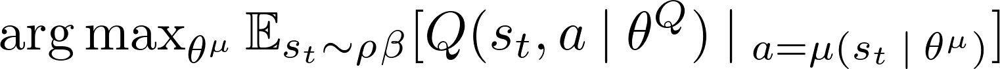
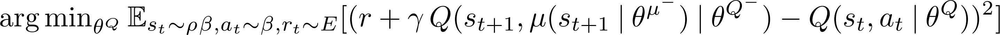

# 1. Learning Algorithm

### 1.1 Actor and Critic Networks

In this work aside from the state space, the action space are also continuous. Actor-critic models are used to approximate continuous actions. To accommodate learning in this continuous action space, batch normalization is applied to normalize state and ease learning. Both actor and critic starts with batch normalization of input states. An actor comprises 2 hidden layers with 128 units, batch normalization, and a ReLU activation, and an output layer with dimension equal to the dimension of action space and a tanh activation since values of torques (of an action) range from -1 to 1. 
```
nn.Sequential(nn.BatchNorm1d(state_space_size)
              nn.Linear(state_space_size, 128),
              nn.BatchNorm1d(128),
              nn.ReLU(),
              nn.Linear(128, 128),
              nn.BatchNorm1d(128),
              nn.ReLU(),
              nn.Linear(128, action_space_size),
              nn.Tanh())
```

A critic, on the other hand, comprises 2 hidden layers: one accepting states as an input having 128 units followed by batch normalization and Relu activation, and the others accepting features returned from the pervious layer concatenated with actions as an input with 128 + the dimension of action space units and a ReLU activation. The output layer is just a linear layer with 1 unit returning an action-value function. 
```
nn.Sequential(nn.BatchNorm1d(state_space_size)
              nn.Linear(state_space_size, 128),
              nn.BatchNorm1d(128)
              nn.ReLU(),
              nn.Linear(128+action_space_size, 128),
              nn.ReLU(),
              nn.Linear(128, 1))
```
Note adding batch normalization after input action worsened learning and causing reduction in obtained rewards.

### 1.2 Deep Deterministic Policy Gradient
[Deep deterministic policy gradient (DDPG)](!https://arxiv.org/abs/1509.02971) similar to a deep Q network (DQN) is an off-policy learning algorithm, which learns to maximize an expected return based on an action-value function. Unlike DQN, according to [Lillicrap et al.](!https://arxiv.org/abs/1509.02971) and [Silver et al.](!https://dl.acm.org/citation.cfm?id=3044850), (deep) DPG is an actor-critic algorithm. It, however, is different from typical actor-critic approaches in which a critic incorporates bootstrapping as in TD-based methods to reduce variances introduced by an actor formulated as a Monte Carlo policy gradient method. DDPG maintains 4 neural networks (instead of 2 as in DQN): 2 for target and behaviour policy networks and 2 for target and up-to-date Q networks. The policy networks are also called actor networks and the Q networks are also called critic networks. <br>

Policy networks approximate an actor function $\mu(s\:|\:\theta^{\mu})$ ($\theta^{\mu}$ denotes network parameters) mapping a state to a specific **continuous action**. An actor aims to maximize an action-value function, <br>
  <br>
where &rho; is a visitation distribution, &beta; is a behavior policy, $\theta^Q$ denotes parameters of a behavior Q network. This corresponding to a code snipplet
```
        actor_loss = -critic_local(states, actor_local(states)).mean()
```
where `critic_local` represent a up-to-date Q network and `actor_local` denotes a behavior policy network. <br>
The algorithm minimizes a difference between an estimated action value  and the return for each state similar to DQN approaches as <br>
 <br>
where $\theta\,^{\mu^-}$ denotes stationary parameters of a target actor network, $\theta\,^{Q^-}$ denotes stationary parameters of a target critic network, and $\mu(s_{t+1}\:|\:\theta^{\mu^-})$ represents a deterministic greedy action determined by the target policy network. The equation corresponds to 
```
        Q_targets_next = critic_target(next_states, actor_target(next_states))
        Q_targets = rewards + (gamma * Q_targets_next * (1 - dones))

        # critic loss
        critic_loss = F.mse_loss(critic_local(states, actions), Q_targets)
```
where `actor_target` represent a stationary actor network and `critic_target` denotes a stationary critic network. <br>

### 1.3 Challenges and Solutions
- **Correlated samples** samples generated from sequentially exploring an environment are not independently and identically distributed. To address this, transitions ($s_t, a_t,r_t,s_{t+1}$) are stored in a replay buffer and sampled uniformly to update actors and critics, i.e., remove correlation.
- **Soft update of target networks** loss functions involves optimized parameters in every term which violates typical gradient calculation and parameter updates in typical optimizers. Soft update makes target network slowly changes, moving the calculation closer to a typically gradient step update for stable optimization problems.
- **Varitions in observation values** observations have different physical units and ranges. Batch normalization is used to make the agent generalize better and ease learning. **Both actors and critics start with batch normalization, and all hidden layers of actor networks as well as all hidden layers of critics are prior to an action input are followed by batch normalization**
- **Exploration** since DDPG is an off-policy learning algorithm, noise can be added to a behavior policy to induce exploration.


### 1.4 Hyper-parameters
The hyper-parameters for DDPG includes
    
* **DDPG**
    * `batch_size`: number of experiences (minibatch size) used to train in each epoch, default `256`
    * $\gamma$: discount rate of rewards, default `.99`
    * $\tau$: strength of the influence of the parameters of the behavior network to the parameters of the target network, default `1e-3`
    * `lr_actor`: learning rate used to modify the values of the learned-actor parameters, default `1e3`
    * `lr_critic`: learning rate used to modify the values of the learned-critic parameters, default `1e3`
    * `epsilon`: strength of noise added to induce exploration (should gradually reduced), default `1.`
    * `epsilon_decay`: reduction of epsilon per parameter update iteration
    * `num_batch_permute`: number of time transition in a replay buffer gets shuffled and sampled, default` 10`.
    
* **Replay Memory**
    * `buffer_size`: size of replay memory, default `1e6`

    
# 2. Agent Performance

### 2.1 Scores
The DDPG agent was able to solve the problem with increasing expected accumulated rewards as shown in Section 4 of `Continuous_Control.ipynb`.


### 2.2 Solved 
The values of the parameters of the actor and the critic of the DDPG agent that successfully solve this problem are stored in `final_actor.pth` and `final_critic.pth` respectively.


# 3. Future Work

* Explore a proximal policy gradient with continuous actions and [generalized advantage estimation](!https://arxiv.org/abs/1506.02438)
* Explore [Distributed Distributional Deterministic Policy Gradients](!https://openreview.net/forum?id=SyZipzbCb) or [D4PG](!https://arxiv.org/pdf/1804.08617.pdf)
