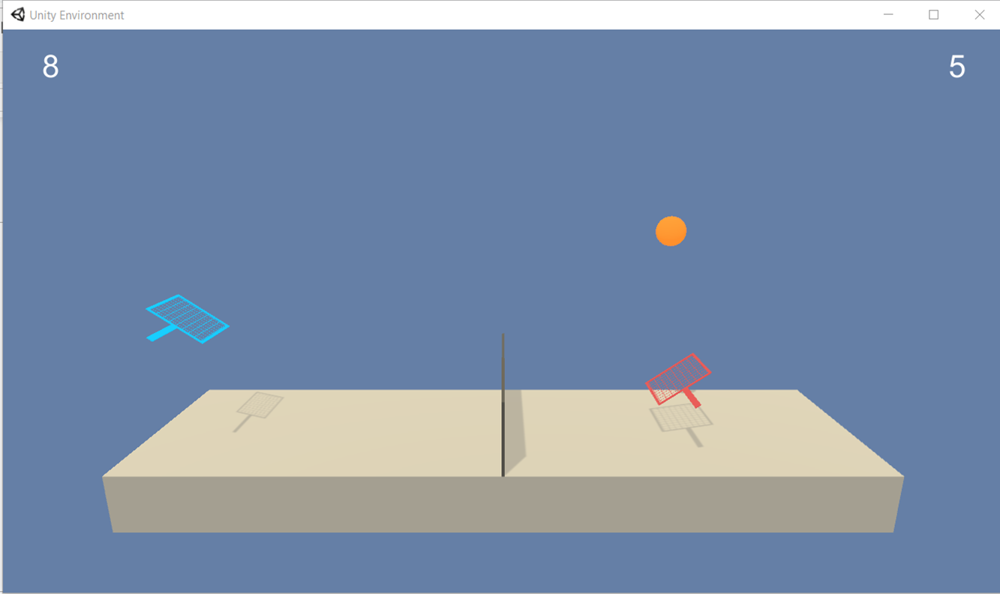

# Project Details

The project is part of [Udacity Deep Reinforcement Learning Nano Degree program](!https://www.udacity.com/course/deep-reinforcement-learning-nanodegree--nd893), involving two agents playing tennis. The problem is solved using **Multi-Agent Deep Deterministic Policy Gradient** [MADDPG](!https://arxiv.org/abs/1706.02275) which allows multi-agents to either cooperate or compete or both in an environment.


**Observation space** has 24 dimensions corresponding to the position and velocity of the ball and racket. Each agent receives its own local observation. <br>
**Continuous action space** has 2 dimensions corresponding to jumping and movement toward (or away from) the net. <br>
**Reward function**
* +0.1 if an agent hits a ball over the net
* -0.01 if an agent lets a ball hit the ground or hits the ball out of bounds <br>

The problem is episodic with the goal of keeping the ball in play and considered solved if the agents attain an average score of +0.5 over 100 consecutive episodes. <br>



# Get Started

### Conda Environment

For those using `conda`, you can create a new `conda` environment as follows.
* _Windows_
```
conda create --name your_env_name python=3.6 
activate your_env_name 
```
* _Linux_ or _MAC_
```
conda create --name your_env_name python=3.6 
source activate your_env_name 
```

### Project Dependencies

The project requires the following libraries to be correctly installed. 

1. **Unity ML-Agents** <br>
   The installation instruction can be found at [Unity-ML website](!https://github.com/Unity-Technologies/ml-agents/blob/master/docs/Installation.md)
   * Download [Unity](!https://store.unity.com/download) 
   * Clone the ML-Agents Toolkit GitHub repository 
   ```
   git clone https://github.com/Unity-Technologies/ml-agents.git
   ```
   * Download [requirements.txt](!https://github.com/Unity-Technologies/ml-agents/blob/master/python/requirements.txt) and install 
   ```
   conda install --yes --file requirements.txt
   ```
2. **Pytorch** <br>
   The pytorch version to install depends on your system configuration (e.g., operating systems, package managers, python versions, and availibility of CUDA). 
   * Select the configuration of your system at [pytorch website](!https://pytorch.org/) and follow the installation instruction described on the webpage.
   

# Instructions¶

## Training

The **MADDPG** agent described in `maddpg.py` comprises two **DDPG** defined in `ddpg.py`. Training the MADDPG agent can be done as described in Section 4 of `maddpg/Tennis.ipynb`. A snippet of the code to train an agent is shown below.
```
# determine torch computing device
device = torch.device("cuda:0" if torch.cuda.is_available() else "cpu")

# set up environment
env = UnityEnvironment(file_name="Banana.exe")
action_size = env.brains[env.brain_names[0]].vector_action_space_size  # get dimension of action space
state_size = env.reset(train_mode=False)[env.brain_names[0]] .vector_observations.size # get dimension of state space

# agent hyperparameters
random_seed = 1234
num_batch_permute = 10
n_episodes=5000
gamma = 0.99
tau = 2.e-1#1.e-3
buffer_size = int(1e6)
batch_size = 1000
device = torch.device("cuda:0" if torch.cuda.is_available() else "cpu")
ddpg_settings = {'state_size':state_size, 'action_size':action_size, 'random_seed':random_seed,
                 'hidden_in_dim':128, 'hidden_out_dim':128, 'activation':F.relu,'tau':tau, 
                 'lr_actor':1e-3, 'lr_critic':1e-3, 'weight_decay':0., 'epsilon':1., 'epsilon_decay':0.}
                 
# create an agent and replay buffer
maddpg = MADDPG(device, random_seed, gamma, ddpg_settings)
replay_buffer = ReplayBuffer(device, action_size, buffer_size, batch_size, random_seed) 

# train the agent  
scores = maddpg_training(maddpg, replay_buffer, n_episodes, noise_scale=2., noise_scale_reduction=0.9999, num_batch_permute=num_batch_permute)
```
`maddpg/TennisTesting.ipynb` shows how to load agent parameters and test the agent after training.
