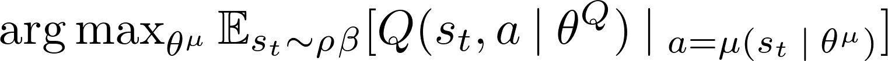
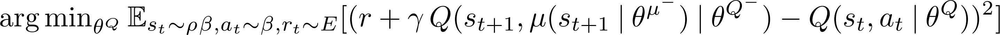
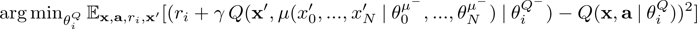
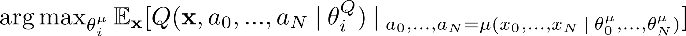
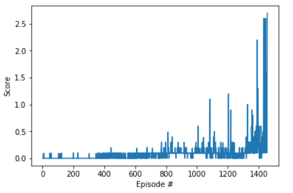

# 1. Learning Algorithm

### 1.1 Actor and Critic Networks

In this work, both state and action spaces are continuous. An multi-agent actor-critic approach is used to estimate continuous actions. Specifically, a multi-agent approach based on **Deep Deterministic Policy Gradient** [DDPG](!https://arxiv.org/abs/1509.02971) called **Multi-Agent Deep Deterministic Policy Agent** [MADDPG](!https://arxiv.org/abs/1706.02275) is used to model two agents competing in tennis. To accommodate and ease learning in continuous action spaces, batch normalization is applied to normalize state. Both actor and critic starts with batch normalization of input states. An actor comprises 2 hidden layers with 128 units, batch normalization, and a ReLU activation, and an output layer with dimension equal to the dimension of action space and a tanh activation since values of an action range from -1 to 1. 
```
nn.Sequential(nn.BatchNorm1d(state_space_size)
              nn.Linear(state_space_size, 128),
              nn.BatchNorm1d(128),
              nn.ReLU(),
              nn.Linear(128, 128),
              nn.BatchNorm1d(128),
              nn.ReLU(),
              nn.Linear(128, action_space_size),
              nn.Tanh())
```

A critic, on the other hand, comprises 2 hidden layers: one accepting states as an input having 128 units followed by batch normalization and Relu activation, and the others accepting features returned from the pervious layer concatenated with actions as an input with 128 + the dimension of action space units and a ReLU activation. The output layer is just a linear layer with 1 unit returning an action-value function. 
```
nn.Sequential(nn.BatchNorm1d(state_space_size)
              nn.Linear(state_space_size, 128),
              nn.BatchNorm1d(128)
              nn.ReLU(),
              nn.Linear(128+action_space_size, 128),
              nn.ReLU(),
              nn.Linear(128, 1))
```
Note adding batch normalization after adding input action worsened learning and causing reduction in obtained rewards.

### 1.2 Deep Deterministic Policy Gradient
[Deep deterministic policy gradient (DDPG)](!https://arxiv.org/abs/1509.02971) similar to a deep Q network (DQN) is an off-policy learning algorithm, which learns to maximize an expected return based on an action-value function. Unlike DQN, according to [Lillicrap et al.](!https://arxiv.org/abs/1509.02971) and [Silver et al.](!https://dl.acm.org/citation.cfm?id=3044850), (deep) DPG is an actor-critic algorithm. It, however, is different from typical actor-critic approaches in which a critic incorporates bootstrapping as in TD-based methods to reduce variances introduced by an actor formulated as a Monte Carlo policy gradient method. DDPG maintains 4 neural networks (instead of 2 as in DQN): 2 for target and behaviour policy networks and 2 for target and learned Q networks. The policy networks are also called actor networks and the Q networks are also called critic networks. <br>

Policy networks approximate an actor function $\mu(s\:|\:\theta^{\mu})$ ($\theta^{\mu}$ denotes network parameters) mapping a state to a specific **continuous action**. An actor aims to maximize an action-value function, <br>
  <br>
where &rho; is a visitation distribution, &beta; is a behavior policy, $\theta^Q$ denotes parameters of a behavior Q network. This corresponding to a code snipplet
```
        actor_loss = -critic_local(states, actor_local(states)).mean()
```
where `critic_local` represent a learned Q network and `actor_local` denotes a behavior policy network. <br>
The algorithm minimizes a difference between an estimated action value  and the return for each state similar to DQN approaches as <br>
 <br>
where $\theta\,^{\mu^-}$ denotes stationary parameters of a target actor network, $\theta\,^{Q^-}$ denotes stationary parameters of a target critic network, and $\mu(s_{t+1}\:|\:\theta^{\mu^-})$ represents a deterministic greedy action determined by the target policy network. The equation corresponds to 
```
        Q_targets_next = critic_target(next_states, actor_target(next_states))
        Q_targets = rewards + (gamma * Q_targets_next * (1 - dones))

        # critic loss
        critic_loss = F.mse_loss(critic_local(states, actions), Q_targets)
```
where `actor_target` represent a stationary actor network and `critic_target` denotes a stationary critic network. <br>

### 1.3 Mult-Agent Deep Deterministic Policy Gradient

**Multi-Agent Deep Deterministic Policy Agent** [MADDPG](!https://arxiv.org/abs/1706.02275) is proposed to address one of the difficulties in multi-agent reinforcement learning, non-stationary environment. It conditions the observation of the next states by actions taken by all the agents in the environment.  Uisng centralized training with decentralized execution, critics are trained using information of the states observed by all agents as well as the agents' policies/actions using the *centralized action-value function* $Q$. Assuming there are $N$ agents, the critic loss for each agent $i$ is represented as <br>
 <br>
where $\mathbf{x'}$ is the stack of next states (observations), $\mathbf{a}$ is the stack of an action of each agent, $\theta_i^{\mu^-}$ is the parameters of the target actor network of an agent $i$ and  
$\theta_i^{Q^-}$ and $\theta_i^{Q}$ are the parameters of the stationary and learned critic networks of an agent $i$, respectively.  <br>
The actors of each agent $i$, on the other hand, learn to maximize the centralized action-value function. 
 <br>
The code for `critic_loss_function` and `actor_loss_function` can be found in `maddpg.py`.

### 1.4 Hyper-parameters
The hyper-parameters for DDPG includes
    
* **MADDPG**

    * $\gamma$: discount rate of rewards, default `.99`
    * $\tau$: strength of the influence of the parameters of the behavior network to the parameters of the target network, default `2.e-1`
    * `lr_actor`: learning rate used to modify the values of the learned-actor parameters, default `1e3`
    * `lr_critic`: learning rate used to modify the values of the learned-critic parameters, default `1e3`
    * `epsilon`: strength of noise added to induce exploration (should gradually reduced), default `1.`
    * `epsilon_decay`: reduction of epsilon per parameter update iteration
    * `num_batch_permute`: number of time transition in a replay buffer gets shuffled and sampled, default` 10`.
    * `noise_scale`: the factor of noise added to actions to encourage exploration
    * `noise_scale_reduction`: the factor used to reduce `noise_scale` as the agents gain for knowlegde about the environment, default `0.9999` 
    
* **Replay Memory**
    * `buffer_size`: size of replay memory, default `1e6`
    * `batch_size`: number of experiences (minibatch size) used to train in each epoch, default `1000`

                 
# 2. Agent Performance

### 2.1 Scores
The MDDPG agent was able to solve the problem with increasing expected accumulated rewards as shown in Section 4 of `Tennise.ipynb` and also shown below.



### 2.2 Solved 
The problem was solved in 1450 episodes. Better hyperparameter settings used during training potentially improve learning speed. Also the degree of noise that better balances exploration and exploitation could increase learning rate. The values of the parameters of the actor and the critic of each DDPG agent that successfully solve this problem are stored in `final_actor_0.pth` and `final_actor_1.pth` and `final_critic_0.pth` and `final_critic_1.pth`, respectively.


# 3. Future Work

* Explore self-learning agent such as that described in [AlphaZero](!https://arxiv.org/abs/1712.01815)

